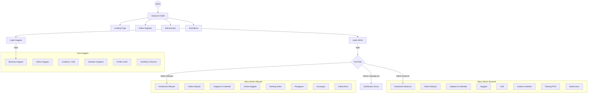
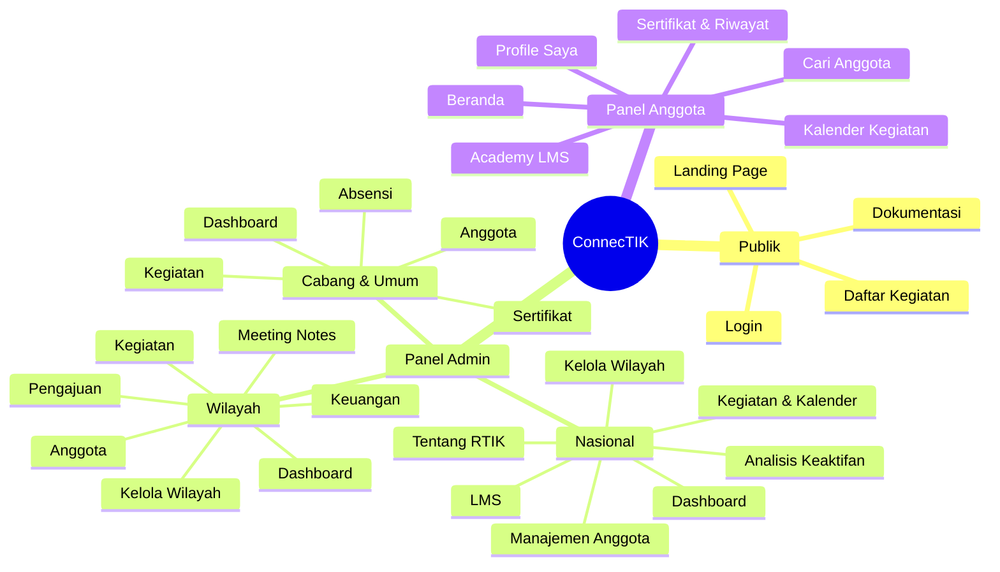

# Struktur dan Navigasi Aplikasi ConnecTIK

Dokumen ini menjelaskan struktur navigasi dan alur aplikasi berdasarkan peran pengguna (User Roles).

## 1. Diagram Navigasi Utama

## 2. Diagram Struktur Hirarki (Mindmap)

Jika Anda ingin melihat struktur dalam bentuk hirarki menu, gunakan diagram berikut:

## 3. Detail Struktur URL dan Navigasi

### A. Publik (Tanpa Login)
*   **Beranda**: `/` (Menampilkan statistik anggota, wilayah, dan kegiatan)
*   **Kegiatan**: `/kegiatan` (Daftar kegiatan publik)
*   **Detail Kegiatan**: `/kegiatan/{id}`
*   **Dokumentasi**: `/docs/RTIK-App-Documentation.docx`
*   **Profil Anggota**: `/anggota/profil/{id}`
*   **Login**:
    *   Admin: `/admin/login`
    *   Anggota: `/anggota/login`

### B. Panel Admin (`/admin`)
Menu yang ditampilkan menyesuaikan dengan role pengguna.

#### 1. Admin Nasional (`role: admin_nasional`)
*   **Dashboard**: `/admin/nasional/dashboard`
*   **Kelola Wilayah**: `/admin/wilayah`
*   **Kegiatan**:
    *   List: `/admin/riwayat-kegiatan`
    *   Kalender: `/admin/riwayat-kegiatan/calendar`
*   **Anggota**: `/admin/anggota`
*   **LMS**: `/admin/lms`
*   **Analisis Keaktifan**: `/admin/analisis-keaktifan`
*   **Tentang RTIK**:
    *   Penjelasan: `/admin/tentang/penjelasan`
    *   Struktur Organisasi: `/admin/tentang/struktur`
*   **Kelola Akun**: `/admin/nasional/account`

#### 2. Admin Wilayah (`role: admin_wilayah`)
*   **Dashboard**: `/admin/wilayah/dashboard`
*   **Kelola Wilayah**: `/admin/wilayah`
*   **Kegiatan**: `/admin/riwayat-kegiatan`
*   **Kelola Anggota**: `/admin/anggota`
*   **Meeting Notes**: `/admin/meeting-notes`
*   **Pengajuan**: `/admin/pengajuan`
*   **Keuangan**: `/admin/keuangan`
*   **Analisis Keaktifan**: `/admin/analisis-keaktifan`
*   **Kelola Akun**: `/admin/account`

#### 3. Admin Cabang & Lainnya (`role: admin_cabang`, `pembina`, dll)
*   **Home**: `/admin/dashboard`
*   **Anggota**: `/admin/anggota`
*   **Kegiatan**: `/admin/riwayat-kegiatan`
*   **Analisis Keaktifan**: `/admin/analisis-keaktifan`
*   **Ranking**: `/admin/absensi/ranking`
*   **Fitur Tambahan (Kecuali Pembina)**:
    *   Absensi: `/admin/absensi`
    *   Sertifikat: `/admin/sertifikat` (Kecuali Cabang)
    *   Meeting Notes: `/admin/meeting-notes`
    *   Pengajuan: `/admin/pengajuan`
    *   LMS: `/admin/lms`
    *   Keuangan: `/admin/keuangan`
    *   Akses Anggota: `/admin/anggota-access`

### C. Panel Anggota (`/anggota`)
*   **Beranda**: `/anggota/beranda`
*   **Daftar Anggota**: `/anggota/anggota-list` (Pencarian anggota)
*   **Academy (LMS)**:
    *   List: `/anggota/academy`
    *   Detail: `/anggota/academy/{slug}`
*   **Kegiatan**:
    *   Kalender: `/anggota/kegiatan/calendar`
    *   Detail: `/anggota/kegiatan/{id}`
    *   Absensi: `/anggota/absensi-kegiatan`
*   **Profile**:
    *   Lihat: `/anggota/profile`
    *   Edit: `/anggota/edit-profile`
*   **Dokumen & Informasi**:
    *   Sertifikat: `/anggota/sertifikat`
    *   Meeting Notes: `/anggota/meeting-notes`
    *   Tentang RTIK: `/anggota/tentang/penjelasan`

## 3. Struktur Folder Views (`resources/views`)

*   `admin/` - Tampilan untuk panel admin
    *   `layouts/` - Layout utama admin (sidebar, navbar)
    *   `nasional/` - View khusus admin nasional
    *   `wilayah/` - View khusus admin wilayah
    *   `anggota/` - Manajemen anggota oleh admin
    *   ... (folder fitur lainnya: keuangan, lms, sertifikat, dll)
*   `anggota/` - Tampilan untuk panel anggota
    *   `layout.blade.php` - Layout utama anggota
    *   `beranda.blade.php`
    *   `academy.blade.php`
    *   ...
*   `public/` - Komponen tampilan publik tambahan
*   `welcome.blade.php` - Landing page utama
